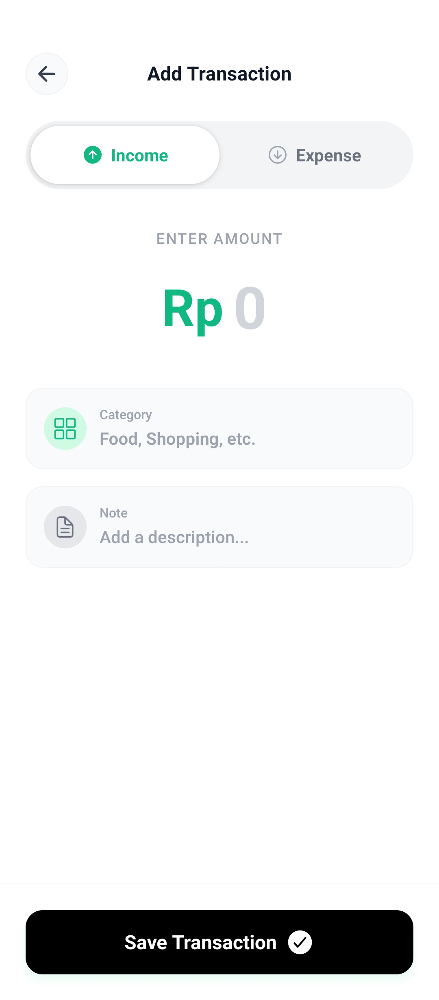
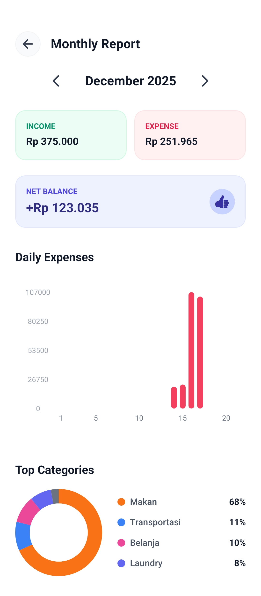

# 💰 myFinance

> A modern, personal finance tracking application built with **React Native**, **Expo**, and **Clean Architecture**.


## 📱 Overview

**myFinance** is designed to help you take control of your financial life. With a local-first approach, it offers lightning-fast performance, offline capabilities, and a beautiful user interface to track your income and expenses effortlessly.

Built with a strict **Clean Architecture**, this project serves as a robust example of scalable React Native development.

## ✨ Features

- **💸 Transaction Tracking**: Easily add income and expenses with categories.
- **📊 Visual Analytics**: Beautiful charts and graphs to understand your spending habits (powered by `react-native-gifted-charts`).
- **🚀 Local-First**: All data is stored locally using **SQLite** and **Drizzle ORM** for instant access and privacy.
- **🎨 Modern UI**: Sleek and responsive design utilizing **NativeWind** (Tailwind CSS) and **Lucide Icons**.
- **🏗️ Clean Architecture**: Clear separation of concerns into Domain, Data, and Presentation layers.

## 📸 Screenshots

| Home Dashboard | Add Transaction | Analytics |
|:---:|:---:|:---:|
|  |  |  |

## 🛠 Tech Stack

- **Framework**: [Expo](https://expo.dev/) (SDK 52) & [React Native](https://reactnative.dev/)
- **Language**: [TypeScript](https://www.typescriptlang.org/)
- **Styling**: [NativeWind](https://www.nativewind.dev/) (Tailwind CSS)
- **Database**: [SQLite](https://docs.expo.dev/versions/latest/sdk/sqlite/)
- **ORM**: [Drizzle ORM](https://orm.drizzle.team/)
- **Navigation**: [Expo Router](https://docs.expo.dev/router/introduction/)
- **Icons**: [Lucide React Native](https://lucide.dev/guide/packages/lucide-react-native)

## 📂 Project Structure

This project follows the **Clean Architecture** principles:

```
myFinance/
├── app/                 # Expo Router (Navigation & screens)
├── src/
│   ├── core/            # Domain Layer (Entities & Use Cases)
│   ├── data/            # Data Layer (Repositories & Datalources)
│   └── presentation/    # UI Layer (Components & State Management)
├── assets/              # Images and Fonts
└── drizzle/             # Database Migrations
```

## 🚀 Getting Started

### Prerequisites

- [Node.js](https://nodejs.org/) (LTS recommended)
- [npm](https://www.npmjs.com/) or [yarn](https://yarnpkg.com/)

### Installation

1.  **Clone the repository**
    ```bash
    git clone https://github.com/your-username/myfinance.git
    cd myfinance
    ```

2.  **Install dependencies**
    ```bash
    npm install
    ```

3.  **Run the application**
    ```bash
    npm run android   # For Android
    npm run ios       # For iOS
    ```

## 📜 Scripts

| Script | Description |
| :--- | :--- |
| `npm start` | Start the Expo development server |
| `npm run android` | Run on Android emulator/device |
| `npm run ios` | Run on iOS simulator/device |
| `npm run reset-project` | Reset the project state (clears cache, etc.) |
| `npm run lint` | Run ESLint to check for code quality |

---

Made with ❤️ by Putra Jangjaya
